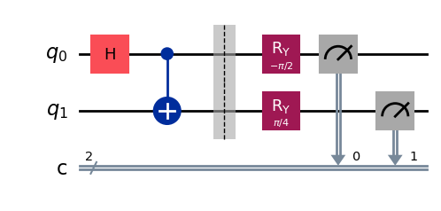
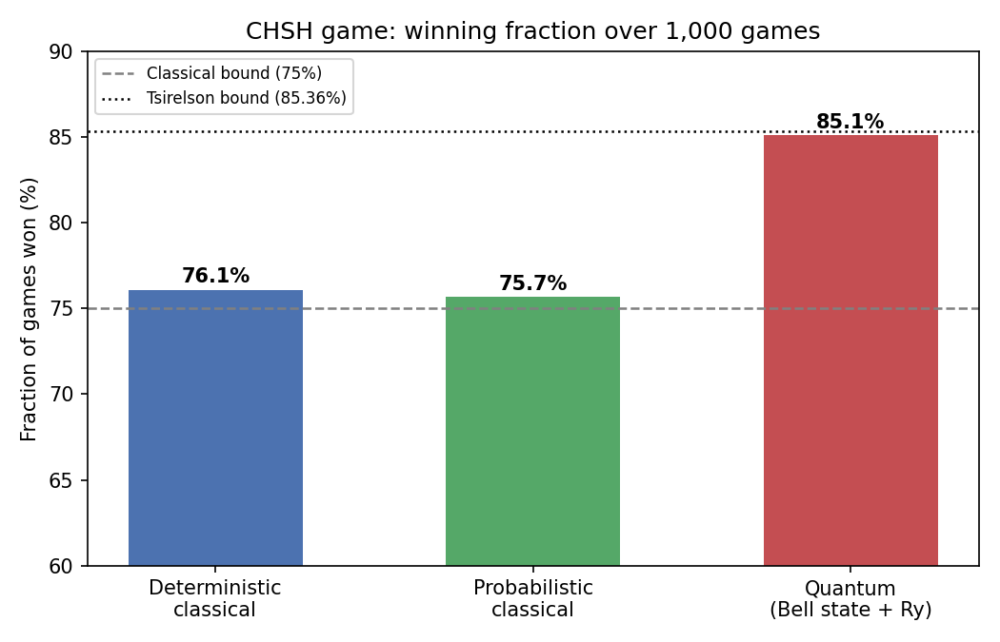

# Quantum Advantage in the CHSH Game: A Qiskit Simulation of Classical and Entangled Strategies

Qiskit implementation of the CHSH nonlocal game, comparing classical strategies (capped at 75%) with an entanglement-assisted quantum strategy (about 85%).

  

## Table of Contents

1. [Overview](#1-overview)
2. [Game Rules](#2-game-rules)
3. [Strategies](#3-strategies)
4. [Quantum Circuits](#4-quantum-circuits)
5. [Results](#5-results)
6. [Merits and Demerits](#6-merits-and-demerits)
7. [Getting Started](#7-getting-started)
8. [References](#8-references)

## 1. Overview

In the CHSH game, two players (Alice and Bob) who cannot communicate answer questions from a referee. This project simulates the game with three strategies, 1,000 rounds each:

- **Deterministic classical**
- **Probabilistic classical** (shared randomness)
- **Quantum** (shared Bell state with $R_y$ measurements, run on `AerSimulator`)

## 2. Game Rules

The referee sends random bits $x$ (to Alice) and $y$ (to Bob). They reply with bits $a$ and $b$ and **win** if

$$a \oplus b = x \wedge y$$

That is, $a = b$ for $(x,y) \in \{(0,0),(0,1),(1,0)\}$ and $a \neq b$ for $(1,1)$.

## 3. Strategies

| Strategy | Approach | Max win probability |
|----------|----------|:-------------------:|
| Deterministic | $a = x$, $b = \lnot y$; no deterministic rule wins all four cases | 75% |
| Probabilistic | A shared random bit picks a deterministic rule; an average cannot beat its parts | 75% |
| Quantum | Shared $\lvert\phi^+\rangle = (\lvert 00\rangle + \lvert 11\rangle)/\sqrt{2}$; each player rotates their qubit by an angle set by their question, then measures | $\cos^2(\pi/8) \approx 85.36\%$ |

Quantum measurement rotations (Qiskit gates):

| Player | Question | Gate |
|--------|:--------:|:----:|
| Alice | $x=0$ | `ry(0)` |
| Alice | $x=1$ | `ry(-π/2)` |
| Bob | $y=0$ | `ry(-π/4)` |
| Bob | $y=1$ | `ry(π/4)` |

## 4. Quantum Circuits

Each circuit prepares the Bell pair (H + CNOT), applies the question-dependent $R_y$ rotations, and measures both qubits. In every case the win probability is $(2+\sqrt{2})/4 \approx 0.854$.

| $(x,y) = (0,0)$ | $(x,y) = (0,1)$ |
|:---:|:---:|
|  |  |
| **$(x,y) = (1,0)$** | **$(x,y) = (1,1)$** |
|  |  |

## 5. Results



| Strategy | Win fraction (1,000 games) | Theoretical limit |
|----------|:--------------------------:|:-----------------:|
| Deterministic classical | 0.761 | 0.75 |
| Probabilistic classical | 0.757 | 0.75 |
| Quantum | **0.851** | 0.8536 |

Both classical strategies stay at the 75% limit (the small excess is sampling noise, about ±1.4%). The quantum strategy matches the Tsirelson bound within statistical error and beats classical play by roughly 10 percentage points, without any communication between players.

## 6. Merits and Demerits

**Merits**
- Fair comparison: all three strategies run through the same referee function.
- Simulation agrees with theory (75% classical bound, $\cos^2(\pi/8)$ quantum value).
- Modular code: referee, strategies and circuit builder are separate functions.

**Demerits**
- Only 1,000 games per strategy in a single run, so results carry roughly 1 to 1.4% statistical error.
- Noiseless simulator only; no noise model or real quantum hardware.
- Only one deterministic strategy is implemented, and the quantum strategy runs one circuit per game (slow).

## 7. Getting Started

```bash
pip install qiskit qiskit-aer pylatexenc matplotlib jupyter
jupyter notebook CHSH_Game.ipynb
```

```text
.
├── CHSH_Game.ipynb
├── README.md
└── images/
    ├── circuit_x0_y0.png
    ├── circuit_x0_y1.png
    ├── circuit_x1_y0.png
    ├── circuit_x1_y1.png
    └── results_comparison.png
```

Image links are relative, so they render on GitHub as long as `images/` sits next to `README.md`.

## 8. References

1. J. F. Clauser, M. A. Horne, A. Shimony, R. A. Holt, *Phys. Rev. Lett.* 23, 880 (1969).
2. B. S. Tsirelson, *Lett. Math. Phys.* 4, 93 (1980).
3. Qiskit documentation: https://docs.quantum.ibm.com

---

**Author:** Muhammad Danyal
